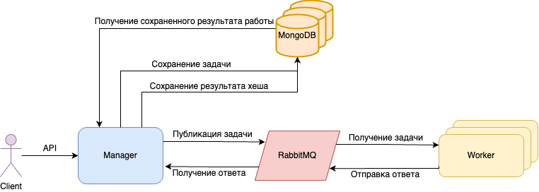

# Лабораторная работа CrackHash

## Описание

CrackHash - распределенная система для взлома MD5 хешей методом перебора (brute-force).

Основные компоненты:

1.  **Менеджер (Manager)** - Принимает HTTP запросы от клиентов, сохраняет состояние задач в MongoDB, отправляет задачи на обработку в очередь RabbitMQ, получает результаты из другой очереди RabbitMQ и предоставляет статус/результат клиенту.
2.  **Воркер (Worker)** - Потребляет задачи из очереди RabbitMQ, выполняет перебор комбинаций для указанной части алфавита, отправляет найденные результаты в другую очередь RabbitMQ. Запускается в нескольких экземплярах.
3.  **RabbitMQ** - Брокер сообщений, используемый для асинхронного и отказоустойчивого взаимодействия между Менеджером и Воркерами. Содержит отдельные очереди для задач и результатов.
4.  **MongoDB Replica Set** - Кластер MongoDB (1 Primary, 2 Secondary), используемый Менеджером для хранения состояния запросов и необработанных задач (при недоступности RabbitMQ), обеспечивая сохранность данных при сбоях.

## Архитектура

 <!-- Замените на реальное имя файла схемы -->

1.  **Клиент** отправляет HTTP POST запрос на `/api/hash/crack` Менеджеру, содержащий MD5 хеш и максимальную длину слова.
2.  **Менеджер**:
    *   Валидирует запрос.
    *   Сохраняет информацию о запросе (ID, хеш, maxLength, статус `NEW`, кол-во частей) в **MongoDB**.
    *   Отвечает Клиенту `{ "requestId": "..." }`.
    *   Асинхронно:
        *   Переводит статус запроса в `IN_PROGRESS` в MongoDB.
        *   Делит пространство поиска на части по числу воркеров.
        *   Формирует сообщения с задачами для каждой части.
        *   Публикует сообщения с задачами в очередь `tasks_queue` в **RabbitMQ**.
        *   *Если RabbitMQ недоступен*: сохраняет сообщения с задачами в отдельную коллекцию MongoDB для последующей отправки.
3.  **Воркер** (несколько экземпляров):
    *   Подписывается на очередь `tasks_queue` в **RabbitMQ**.
    *   Получает сообщение с задачей.
    *   Выполняет перебор слов в назначенном диапазоне, вычисляя MD5 для каждого.
    *   Если найдены совпадения, формирует сообщение с результатом (ID запроса, номер части, найденные слова).
    *   Публикует сообщение с результатом в очередь `results_queue` в **RabbitMQ**.
    *   Подтверждает (`Ack`) получение исходного сообщения с задачей **только после** успешной отправки результата. *Если воркер падает до Ack, задача вернется в очередь.*
4.  **Менеджер**:
    *   Подписывается на очередь `results_queue` в **RabbitMQ**.
    *   Получает сообщение с результатом от воркера.
    *   Обновляет информацию о запросе в **MongoDB**: инкрементирует счетчик полученных частей, добавляет найденные слова.
    *   Если получены результаты от всех частей, переводит статус запроса в `READY` в MongoDB.
    *   Подтверждает (`Ack`) получение сообщения с результатом.
5.  **Клиент** периодически отправляет HTTP GET запрос на `/api/hash/status?requestId=...` Менеджеру.
6.  **Менеджер** читает актуальный статус и данные из **MongoDB** и возвращает их Клиенту.

## Установка и запуск

### Требования
- Docker Compose

### Запуск системы

```bash
docker-compose up --build -d
```

Система запустит:
*   Менеджер (1 экземпляр)
*   Воркеры (3 экземпляра по умолчанию)
*   RabbitMQ с Management UI
*   MongoDB Replica Set (3 узла + инициализатор)

**Доступные сервисы:**

*   **Менеджер API:** `http://localhost:8080`
*   **RabbitMQ Management UI:** `http://localhost:15672` (логин/пароль: `guest`/`guest`)

## Конфигурация

Доступна конфигурация в `docker-compose.yml` файле:
* Изменение количество воркеров;
* Изменение url и портов;
* Изменение количества реплик mongoDB.


## API

### Публичное API менеджера (для клиентов)

#### Запрос на взлом хеша

```js
POST url/api/hash/crack
```

**Request body:**
```json
{
    "hash": "d077f244def8a70e5ea758bd8352fcd8",
    "maxLength": 4
}
```

**Response:**
```json
{
    "requestId": "aec7b2fb-bc25-4586-a05d-c21bb7b23358"
}
```

#### Проверка статуса запроса

```js
GET url/api/hash/status?requestId=aec7b2fb-bc25-4586-a05d-c21bb7b23358
```

**Response (в процессе):**
```json
{
    "status": "IN_PROGRESS",
    "data": null,
    "progressPct": 33.3
}
```

**Response (готов):**
```json
{
    "status": "READY",
    "data": ["abcd"],
    "progressPct": 100
}
```

### Внутреннее взаимодействие (через RabbitMQ)

Взаимодействие между Менеджером и Воркерами происходит асинхронно через сообщения в RabbitMQ.

#### Сообщение с задачей (Менеджер → Воркер)

* Exchange: tasks_exchange (direct)
* Routing Key: task.crack.request
* Queue: crackhash_tasks
* Body (JSON): Соответствует структуре models.WorkerRequest
```json
{
    "requestId": "730a04e6-4de9-41f9-9d5b-53b88b17afac",
    "partNumber": 0,
    "partCount": 3,
    "hash": "e2fc714c4727ee9395f324cd2e7f331f",
    "maxLength": 4
}
```

#### Сообщение с результатом (Воркер → Менеджер)

* Exchange: tasks_exchange (direct)
* Routing Key: task.crack.result
* Queue: results_queue
* Body (JSON): Соответствует структуре models.WorkerResponse
```json
{
    "requestId": "730a04e6-4de9-41f9-9d5b-53b88b17afac",
    "words": ["abcd"],
    "partNumber": 0
}
```

## Статусы запроса

- `NEW` - запрос создан
- `IN_PROGRESS` - запрос обрабатывается
- `READY` - запрос выполнен успешно
- `ERROR` - ошибка при выполнении запроса